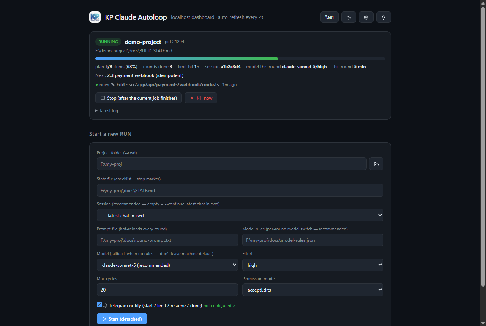
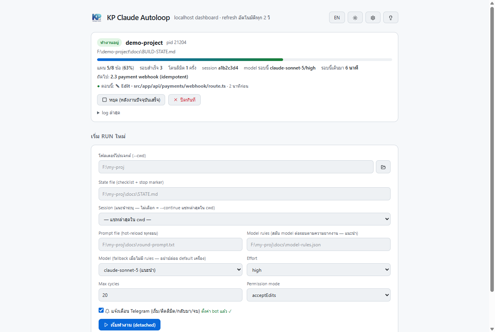
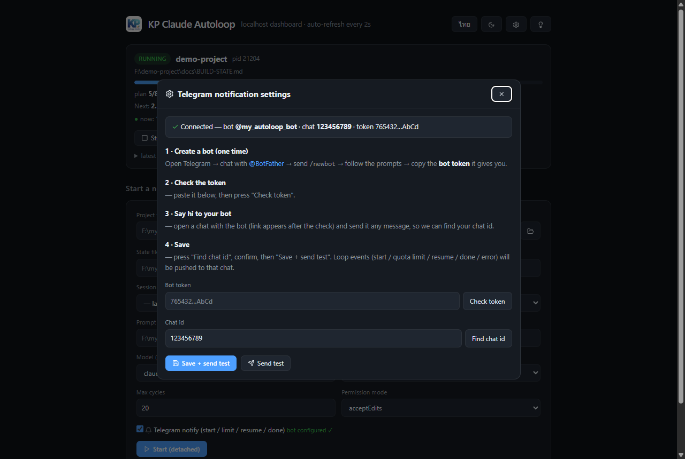

# KP Claude Autoloop

ปกติ Claude Code จะทำงานเฉพาะตอนที่เรานั่งคุยกับมัน พอโควตาการใช้งานหมด (ลิมิตรอบละ ~5 ชั่วโมง) ทุกอย่างก็หยุดรอเราอย่างเดียว งานใหญ่ ๆ เลยลากยาวเป็นวัน ๆ เพราะต้องคอยกลับมาสั่ง "ทำต่อ" เองทุกครั้ง

**KP Claude Autoloop ทำหน้าที่นั้นแทนคุณ** — มันคือโปรแกรมเล็ก ๆ ที่คอยปลุก Claude ให้ลุกมาทำงานต่อทีละรอบจนงานเสร็จจริง ถ้าโควตาหมดกลางทาง มันจะอ่านเวลารีเซ็ตจากคำตอบของ Claude เอง นอนรอถึงเวลานั้น แล้วกลับมาทำต่อโดยอัตโนมัติ พร้อมส่งความคืบหน้าเข้า Telegram ให้ดูจากมือถือได้ตลอด

ไม่ต้องติดตั้งอะไรเพิ่ม — มีแค่ Node.js กับ `claude` CLI ที่ login ไว้แล้ว และมี **หน้าเว็บ dashboard** ไว้สั่งงานและตามดูทุกอย่างโดยไม่ต้องแตะ terminal เลย



## ต่างจากตัวเลือกอื่นยังไง

- คำสั่ง `/loop` ในแชท Claude ตั้งปลุกตัวเองได้ไม่เกินราว 1 ชั่วโมง และถ้าโดนลิมิตกลางคันมันจะตายถาวร ไม่ฟื้นเอง
- Cloud routines (งานตั้งเวลาบนคลาวด์) ฟื้นตัวเองได้ก็จริง แต่มองไม่เห็นเครื่องของคุณ — เข้า localhost ไม่ได้ ไม่เห็นงานที่ยังไม่ push ไม่เห็นไฟล์ในเครื่อง
- **Autoloop อยู่ตรงกลางพอดี**: รันบนเครื่องคุณ เห็นทุกอย่างที่ Claude session เดิมเห็น และฟื้นตัวเองหลังลิมิตได้เหมือนงานบนคลาวด์

## เริ่มใช้งาน (Windows)

**ขั้นที่ 1 — ติดตั้งครั้งเดียว:** โคลนโปรเจกต์แล้วดับเบิลคลิก `setup.cmd`

```bash
git clone https://github.com/kpcrmv4/kp-claude-autoloop.git
```

ตัว setup จะตรวจว่าเครื่องมี Node.js / Claude CLI / Git ครบหรือยัง ขาดตัวไหนจะสรุปให้ดูก่อนแล้วถามยืนยัน (พิมพ์ `Y` แล้ว Enter) ถึงค่อยติดตั้งให้ เสร็จแล้วจะได้**ชอร์ตคัตบนหน้าจอ Desktop** — ต่อจากนี้แค่ดับเบิลคลิกชอร์ตคัตก็เปิด dashboard ได้เลย (ถ้า dashboard เปิดค้างอยู่แล้ว มันจะไม่เปิดซ้อน แค่พาเข้าหน้าเว็บ)

**ขั้นที่ 2 — ให้ Claude เขียนแผนงาน (ครั้งเดียวต่อโปรเจกต์):** เปิด dashboard แล้วกดปุ่มหลอดไฟมุมขวาบน จะมีข้อความสำเร็จรูปให้คัดลอกไปวางในแชท Claude Code ของโปรเจกต์ที่จะให้ทำ — Claude จะสร้างไฟล์แผนงาน, checklist, คำสั่งประจำรอบ และกติกาเลือก model ให้ครบเอง

**ขั้นที่ 3 — กดเริ่ม:** กลับมาที่ dashboard เลือกโฟลเดอร์โปรเจกต์ ระบบจะหาไฟล์แผนงานที่ Claude สร้างไว้แล้วกรอกฟอร์มให้เองอัตโนมัติ กด "เริ่มทำงาน" แล้วปิดหน้าเว็บทิ้งได้เลย งานจะเดินต่อเองจนจบ

**อยากให้ AI ติดตั้งแทน?** ส่งลิงก์ repo นี้ให้ Claude แล้วบอกว่า "ติดตั้งให้หน่อย" ได้เลย ขั้นตอนที่ถูกต้องสำหรับ agent คือ:

```bash
git clone https://github.com/kpcrmv4/kp-claude-autoloop.git && cd kp-claude-autoloop
node bin/autoloop.mjs doctor --yes    # ตรวจเครื่องมือ + ติดตั้งที่ขาด + สร้างชอร์ตคัต โดยไม่ถามอะไร
node bin/autoloop.mjs ui --open       # เปิด dashboard ให้ผู้ใช้ทันที
```

> ⚠ สำหรับ AI agent: ห้ามรัน `setup.cmd` — ไฟล์นั้นมีคำถามให้คนกดตอบ ถ้ารันใน shell อัตโนมัติจะค้างไปเลย ใช้ `doctor --yes` แทน

ถ้าใช้ Claude Code เป็นหลัก ติดตั้งเป็น skill ได้ด้วย (พิมพ์ `/autoloop` ในแชทเพื่อให้ Claude ตั้งค่าทุกอย่างให้):

```bash
npx skills add https://github.com/kpcrmv4/kp-claude-autoloop --skill autoloop
```

## หน้า dashboard มีอะไรให้บ้าง

```bash
node bin/autoloop.mjs ui          # เปิดที่ http://127.0.0.1:4900 (เปลี่ยนพอร์ตได้ด้วย --port)
node bin/autoloop.mjs ui --open   # แบบเดียวกัน แต่เปิดเบราว์เซอร์ให้ด้วย
```

หน้าเดียวเห็นงานทุกตัวบนเครื่อง แต่ละงานมีการ์ดของตัวเองที่อัปเดตสดทุก 2 วินาที บอกว่า:

- **สถานะตอนนี้** — กำลังทำงาน, กำลังรอโควตา (พร้อมตัวนับถอยหลังว่าจะกลับมากี่โมง), เสร็จแล้ว, เจอปัญหา หรือ "ตายกลางคัน" (เคสที่โปรเซสหายไปเงียบ ๆ ซึ่งปกติมองไม่เห็นจาก log — การ์ดจะฟ้องให้)
- **ความคืบหน้าจริง** — แถบเปอร์เซ็นต์นับจาก checklist ในไฟล์แผนงาน พร้อมบอกว่าข้อถัดไปคืออะไร และตอนนี้ Claude กำลังแตะไฟล์ไหนอยู่ (อัปเดตสดระหว่างรอบ ไม่ต้องเดาว่าค้างหรือเปล่า)
- **ปุ่มหยุด 2 แบบ** — "หยุด (หลังงานปัจจุบันเสร็จ)" จะรอให้ Claude เก็บงานรอบที่ค้างให้เรียบร้อยก่อนค่อยหยุด ส่วน "ปิดทันที" จะถามยืนยันแล้วตัดโปรเซสทิ้งเลย (งานที่ค้างจะถูกกู้เองตอนรันรอบหน้า)
- **รันต่อจากเดิมได้** — การ์ดของงานที่หยุดไปแล้วมีปุ่ม "รันต่อจากเดิม" กดปุ๊บมันใช้ค่าเดิมทั้งหมดรวมถึงแชทตัวเดิมเป๊ะ ๆ (ระบบจำ session ที่ถูกต้องไว้ให้ตั้งแต่รอบแรก จะไม่มีทางไปคุยผิดแชท)
- **แก้กติกา model กลางทางได้** — กล่อง model rules บนการ์ดแก้แล้วมีผลรอบถัดไปทันที ไม่ต้องหยุดงาน

เรื่องทั่วไป: สลับภาษาไทย/อังกฤษและโหมดมืด/สว่างได้จากหัวเว็บ (เปิดครั้งแรกเป็นอังกฤษ และจำค่าที่เลือกไว้), เว็บเปิดเฉพาะในเครื่องตัวเอง (`127.0.0.1`) คนนอกเข้าไม่ได้, และไม่โหลดอะไรจากอินเทอร์เน็ตเลย ทุกอย่างฝังมากับตัวโปรแกรม

| โหมดสว่าง + ภาษาไทย | ตั้งค่าแจ้งเตือน Telegram จากหน้าเว็บ |
|---|---|
|  |  |

## แจ้งเตือนเข้า Telegram

ตั้งค่าครั้งเดียวจากปุ่มเฟืองบนหน้าเว็บ (มีคู่มือ 4 ขั้นในนั้น ใช้เวลาประมาณ 2 นาที) หรือจะใช้ตัวช่วยใน CLI ก็ได้:

```bash
node bin/autoloop.mjs notify-setup   # ถาม token, ตรวจกับ Telegram จริง, หา chat id ให้เอง, ยิงทดสอบปิดท้าย
node bin/autoloop.mjs notify-test    # ส่งข้อความทดสอบซ้ำเมื่อไหร่ก็ได้
```

หลังตั้งค่าแล้ว ระบบจะส่งข้อความเฉพาะจังหวะที่ควรรู้ ไม่สแปมทุกรอบ ได้แก่ ตอนเริ่มงาน, ตอนโดนลิมิต (บอกด้วยว่าจะกลับมาทำต่อกี่โมง), ตอนฟื้นกลับมาทำต่อสำเร็จ, ตอนงานเสร็จ, ตอนเจอปัญหาที่ต้องเข้ามาดู และตอนถูกสั่งหยุด — **ทุกข้อความแนบความคืบหน้าล่าสุด** (เสร็จกี่ข้อจากทั้งหมด กี่เปอร์เซ็นต์ ข้อถัดไปคืออะไร) เท่ากับดู progress จากมือถือได้โดยไม่ต้องเปิดคอม

**พิมพ์ถามบอทกลับได้ด้วย** — ตราบใดที่ dashboard เปิดอยู่ เปิดแชทกับบอทแล้วพิมพ์:

- `/status` — สถานะล่าสุดของทุกงาน (คืบหน้ากี่ %, กำลังทำข้อไหน, จะตื่นกี่โมงถ้ากำลังรอโควตา)
- `/stop` — สั่งหยุดจากมือถือ แบบรอให้งานรอบปัจจุบันเสร็จก่อน (มีหลายงานให้ระบุเลข เช่น `/stop 2`)

บอทตอบเฉพาะแชทที่ตั้งค่าไว้เท่านั้น — คนอื่นบังเอิญเจอบอทแล้วทักมา จะถูกเมินเงียบ ๆ

ถ้าไม่ใช้ Telegram จะตั้งเป็น webhook ทั่วไป (Discord, Slack ฯลฯ) ผ่านไฟล์ `autoloop.secrets.json` หรือ environment variable ก็ได้ — ดูตัวอย่างใน `autoloop.secrets.example.json`

> **เรื่องความลับ:** token ของบอทเก็บใน `autoloop.secrets.json` ซึ่งถูกกันไม่ให้ขึ้น git ตั้งแต่ต้น โค้ดไม่เคยพิมพ์ token เต็ม ๆ ที่ไหน (โชว์เฉพาะแบบปิดบางส่วน เช่น `883xxx…xxxx`) และหน้าเว็บก็ไม่มีทางดึง token เต็มกลับไปได้

## มันทำงานยังไงข้างใน

หัวใจคือวงจรง่าย ๆ ที่ทำซ้ำจนกว่างานจะจบ:

```
┌────────────────────────────────────────────────────────┐
│ ทุกรอบ:                                                 │
│ 1. อ่านไฟล์แผนงาน → ถ้าเจอคำว่า AUTOLOOP: COMPLETE      │
│    แปลว่างานครบแล้ว → จบสวย ✅                          │
│ 2. ปลุก claude ให้ทำงานต่อในแชทเดิม (คำสั่งประจำรอบ)     │
│ 3. ถ้าโดนลิมิต → อ่านเวลารีเซ็ตจริงจากคำตอบ              │
│    → นอนรอถึงเวลานั้น (บวกกันเหนียว 90 วิ)               │
│    → กรณีอ่านเวลาไม่ออกจริง ๆ ถึงใช้ค่าสำรอง 5 ชม.       │
│ 4. รอบสำเร็จ → นับรอบ → วนกลับไปข้อ 1                   │
│ 5. เจอ error ที่ไม่ใช่ลิมิต → หยุดทันที ไม่วนมั่ว          │
│ ทุกจังหวะ → จดสถานะลงไฟล์ .autoloop.json ข้างไฟล์แผน     │
└────────────────────────────────────────────────────────┘
```

มีไฟล์เกี่ยวข้องแค่ 2 ตัว แบ่งหน้าที่กันชัดเจน:

| ไฟล์ | ใครเป็นคนเขียน | ข้างในมีอะไร |
|---|---|---|
| `STATE.md` (ไฟล์แผนงาน — คุณเลือกที่วางเอง) | ตัว Claude ที่ทำงาน อัปเดตทุกรอบ | checklist ของงาน และคำว่า `AUTOLOOP: COMPLETE` เมื่อเสร็จครบ |
| `STATE.md.autoloop.json` | autoloop เขียนให้อัตโนมัติ | สถานะล่าสุด: ทำไปกี่รอบ โดนลิมิตกี่ครั้ง จะตื่นกี่โมง ฯลฯ (ลบทิ้งได้ตลอด ไม่มีความลับ) |

**เงื่อนไขที่ทำให้ loop หยุด (มีทางออกครบทุกเคส):** งานเสร็จจริง (เจอ marker ในไฟล์แผน — เช็คก่อนเผาโควตาทุกรอบ), Claude ตอบยืนยันว่าเสร็จ, ทำครบจำนวนรอบสูงสุดที่ตั้งไว้, โดนลิมิตซ้ำเกินเพดาน, เจอ error จริงที่ต้องให้คนมาดู หรือคุณสั่งหยุดเอง — ไม่มีทางวิ่งไม่รู้จบ

## สำหรับสาย command line

ทุกอย่างที่หน้าเว็บทำได้ สั่งผ่าน CLI ได้หมด:

```bash
# ดูรายชื่อแชทในเครื่อง เพื่อเอา session id ของแชทที่จะให้ทำงานต่อ
node bin/autoloop.mjs list

# ปล่อยรันเบื้องหลัง
node bin/autoloop.mjs start \
  --cwd "F:\my-proj" \
  --session <SESSION_ID> \
  --state-file "F:\my-proj\docs\STATE.md" \
  --prompt-file "F:\my-proj\docs\round-prompt.txt" \
  --permission-mode acceptEdits \
  --max-cycles 20

# ดูสถานะ / สั่งหยุด
node bin/autoloop.mjs status --state-file "F:\my-proj\docs\STATE.md"
node bin/autoloop.mjs stop   --state-file "F:\my-proj\docs\STATE.md"          # รอให้งานรอบปัจจุบันเสร็จก่อน
node bin/autoloop.mjs stop   --state-file "F:\my-proj\docs\STATE.md" --force  # ตัดทิ้งทันที
```

ถ้ารันโหมด `run` ในเทอร์มินัลจริง (แทนที่จะเป็น `start` แบบเบื้องหลัง) จะได้จอสดแบ่งสองส่วน: ครึ่งบนปักหมุดแสดงรอบที่เท่าไหร่ ความคืบหน้ากี่เปอร์เซ็นต์ ขั้นตอนถัดไป ส่วนครึ่งล่างสตรีมงานของ Claude แบบสด ๆ ว่ากำลังเรียกเครื่องมือไหน แก้ไฟล์อะไร และตอนติดลิมิตจอจะสลับเป็นแผงนับถอยหลังบอกว่าโควตาปลดล็อกกี่โมง

### Flags ทั้งหมด

| flag | ค่าเริ่มต้น | ความหมาย |
|---|---|---|
| `--state-file` | (ต้องระบุ) | ไฟล์แผนงานกลาง — จุดที่เช็คว่างานเสร็จหรือยัง |
| `--session` | แชทล่าสุดใน cwd | ระบุแชทเป้าหมายตรง ๆ (แนะนำให้ระบุเสมอ กันไปคุยผิดแชท — ถ้าไม่ระบุ ระบบจะล็อกแชทที่ถูกต้องให้เองหลังรอบแรก) |
| `--prompt-file` / `--prompt` | ข้อความกลาง ๆ | คำสั่งประจำรอบ — แบบไฟล์จะถูกอ่านใหม่ทุกรอบ แก้กลางทางได้ |
| `--stop-marker` | `AUTOLOOP: COMPLETE` | คำที่ใช้ประกาศว่างานเสร็จ |
| `--fallback-wait-min` | `300` (5 ชม.) | รอนานเท่าไหร่ในกรณีที่อ่านเวลารีเซ็ตจริงไม่ออก |
| `--max-cycles` / `--max-waits` | 30 / 20 | เพดานจำนวนรอบสำเร็จ / เพดานจำนวนครั้งที่ยอมรอลิมิต |
| `--buffer` / `--min-retry` | 90 / 60 วินาที | เผื่อเวลาหลังรีเซ็ต / ระยะห่างขั้นต่ำระหว่างการลองใหม่ |
| `--permission-mode` | — | ส่งต่อให้ claude (แนะนำ `acceptEdits`) |
| `--model` / `--effort` | default ของเครื่อง | ล็อก model กับระดับความคิด — โหมดเบื้องหลังไม่จำค่าที่ตั้งใน IDE **ควรระบุเสมอ** ไม่งั้นอาจวิ่ง model แพงสุดโดยไม่รู้ตัว |
| `--model-rules <file>` | — | สลับ model อัตโนมัติต่อรอบตามความยากของงานข้อถัดไป (เช่น เรื่องเงิน/ภาษีใช้ opus ที่เหลือใช้ sonnet) — แก้ไฟล์กลางทางได้ มีผลรอบถัดไป ดูตัวอย่างใน `examples/model-rules.example.json` |
| `--cooldown` | 0 | พักระหว่างรอบ — อย่าตั้งเกิน ~240 วินาที เพราะ cache ของ prompt หมดอายุที่ 5 นาที ตั้งนานกว่านั้นเท่ากับจ่ายเต็มราคาทุกรอบ |
| `--no-protocol` | — | ปิดการเติม "กติกา loop" ท้ายคำสั่งอัตโนมัติ (ปกติระบบจะเติมให้เมื่อคำสั่งประจำรอบไม่ได้พูดถึง stop marker — กันเคสลืมบอกวิธีจบงาน) |
| `--claude-arg <x>` | — | ส่ง flag อื่นทะลุไปถึง claude ตรง ๆ (ใส่ซ้ำได้หลายตัว) |
| `--timeout` | 0 | ฆ่ารอบที่ค้างเกินกี่วินาที |
| `--claude-cmd` | `claude` | ชี้ไป binary อื่น (ไว้ทดสอบด้วยตัวปลอม) |

## เคล็ดลัดประหยัดโควตา (อ่านก่อนปล่อยรันยาว)

ทุกรอบที่ปลุก Claude มี "ค่าใช้จ่ายคงที่" ที่หนีไม่พ้น เช่น การโหลดบริบทโปรเจกต์และอ่านแผนใหม่ ดังนั้นถ้าตั้งค่าไม่ดี งานที่ได้ต่อโควตาจะน้อยกว่าที่ควรมาก ข้อแนะนำ:

- **ล็อก model เสมอ** — โหมดเบื้องหลังไม่ใช้ model ที่ตั้งไว้ใน IDE ถ้าไม่ระบุ มันจะใช้ตัว default ของเครื่องซึ่งมักเป็นตัวแพงสุด แนะนำ `--model claude-sonnet-5 --effort high` หรือใช้ model-rules ที่ตั้งค่าเริ่มต้นเป็น sonnet แล้วสงวน opus ไว้เฉพาะข้อยาก
- **สั่งงานเป็นชุด** — คำสั่งประจำรอบควรบอกให้ทำครั้งละ 3-5 ข้อ ไม่ใช่ข้อเดียวแล้วจบรอบ เพราะค่า overhead ต่อรอบเท่ากันไม่ว่าจะทำมากหรือน้อย (ดูตัวอย่างใน `examples/round-prompt.example.txt`)
- **เริ่มจากแชทสะอาด** — อย่าเอาแชทที่คุยกันมายาว ๆ มาเข้า loop เพราะประวัติทั้งก้อนถูกลากไปด้วยทุกรอบ สร้างแชทใหม่ที่มีแค่แผนงานแล้วใช้แชทนั้น
- **ตรวจงานแบบพอดี** — ให้ typecheck ทุกข้อ แต่รัน test เต็มชุดแค่ทุก ~3 ข้อหรือตอนจบ feature เพราะ log ยาว ๆ ของ test จะกลายเป็นภาระของรอบถัดไป
- **ปิด MCP ที่ไม่ใช้** — โปรเจกต์เป้าหมายควรเปิดเฉพาะ MCP ที่จำเป็น เพราะข้อมูลของทุกตัวถูกโหลดใหม่ทุกครั้งที่ cache เย็น

## กติกาที่ทำให้ปลอดภัย

- **หนึ่งแชทมีคนขับได้คนเดียว** — ระหว่างที่ loop กำลังรัน อย่าเปิดแชทตัวนั้นเข้าไปพิมพ์เอง เดี๋ยวงานตีกัน (ระบบกันการรันซ้อนบนไฟล์แผนเดียวกันให้อยู่แล้ว)
- คำสั่งประจำรอบควรขึ้นต้นด้วยการกู้งานค้าง เผื่อรอบก่อนถูกตัดกลางคัน — ถ้าคุณใช้ข้อความสำเร็จรูปจากปุ่มหลอดไฟ อันนี้ถูกใส่มาให้แล้ว
- โหมดเบื้องหลังตอบคำถามขออนุญาตไม่ได้ ให้ใช้ allowlist ของโปรเจกต์ร่วมกับ `--permission-mode acceptEdits` และ**อย่าใช้** `--dangerously-skip-permissions` เด็ดขาด
- ตัวโปรแกรมไม่เก็บรหัสอะไรของ Claude เลย มันแค่เรียก `claude` CLI ที่คุณ login ไว้อยู่แล้ว

## ทดสอบ

```bash
npm test   # ทดสอบครบวงจรกับ claude ตัวปลอม (โดนลิมิต → นอนรอ → ฟื้น → จบด้วย marker) ไม่เผาโควตาจริง
```

---

## English (short)

**KP Claude Autoloop** keeps a long-running Claude Code session working across subscription usage limits. A small Node watchdog wakes the same session round after round until a **stop marker** appears in your shared plan file. On a usage limit it parses the real reset time from Claude's own output and sleeps past it (with a configurable 5-hour fallback). Comes with a localhost **web dashboard** (start/stop/monitor every run, live "what Claude is doing now", EN/TH, dark/light), **Telegram notifications** that carry plan progress in every message (plus two-way bot commands: `/status`, `/stop`), per-round **model switching rules**, a guided installer (`setup.cmd` / `autoloop doctor`) that also drops a desktop shortcut, and a Claude Code **skill** (`/autoloop`). Zero runtime dependencies, MIT.

---

Made with ❤ by [KP Webapp Studio](https://www.kpwebappstudio.tech) · MIT License
